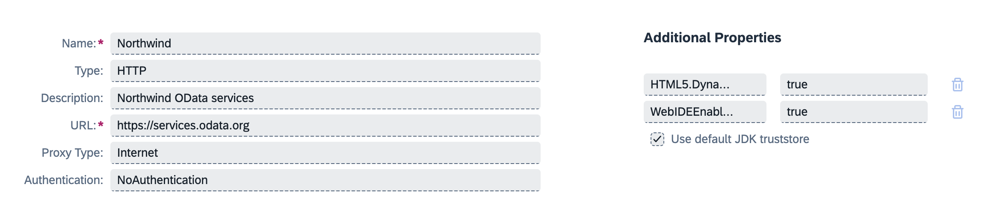
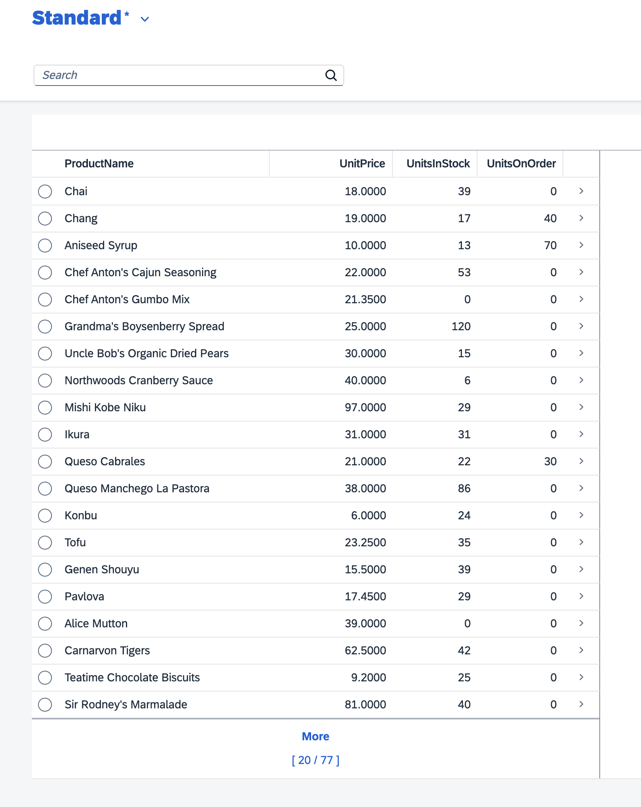

# Products - Sample app - Simple Fiori App with Approuter deploy to CF

This sample shows a simple fiori app that is created with the BAS wizards and uses a custom approuter.
The SAP Developer tutorials for this scenario seem to have been removed!
An Easy-ui5 generated app failed to connected to the Northwind OData service - so this is the current best option!

This app style is ideal when you do not want to serve your app via Work Zone.

If you want to use the managed approuter from Work Zone instead, then see this standard tutorial: https://developers.sap.com/mission.sapui5-cf-first.html.

# How-To

__Prerequisite__: Create a Destination to your OData service. I chose to use the Northwind sample service.

When asked (during the fiori wizard), enter the odata url as: `https://services.odata.org/V2/Northwind/Northwind.svc/`.

__Project generation steps__:
1. Setup BAS / Build Code with a Fiori development space
1. Use the Template Wizard to create a new multi-target (MTA) project (I called it `products`)
1. Right-click the mta.yaml file and choose to add a new module - choose Approuter
1. Select the custom approuter (and not the managed approuter)
1. When prompted, say YES to authorisation and HTML UI apps
1. Right-click the mta.yaml and add another module - this time a Fiori app
1. Choose the type of fiori app - in this instance I chose a Fiori Elements list report
1. Enter the OData service url as above - `https://services.odata.org/V2/Northwind/Northwind.svc/`
1. Ensure to say YES to adding deployment information
1. Choose Cloud Foundry as the deployment target and specify the pre-created subaccount-level destination (Northwind)
1. Continue building your fiori app with the Page Map tool (e.g. add columns to the list and set teh auto-run flag)
1. Test run locally by clicking the green "run" button or by clicking "Preview" in the application info window.

Check the deploy logs for the approuter URL and use it to launch the app. Alternatively you can find the url by looking in the BTP cockpit for the approuter running in the CF space you deployed to.

> NOTE: You can only add XML annotations to a fiori elements app that is basead on an external OData service. Use the Open Guided Development option for this.

# Result
